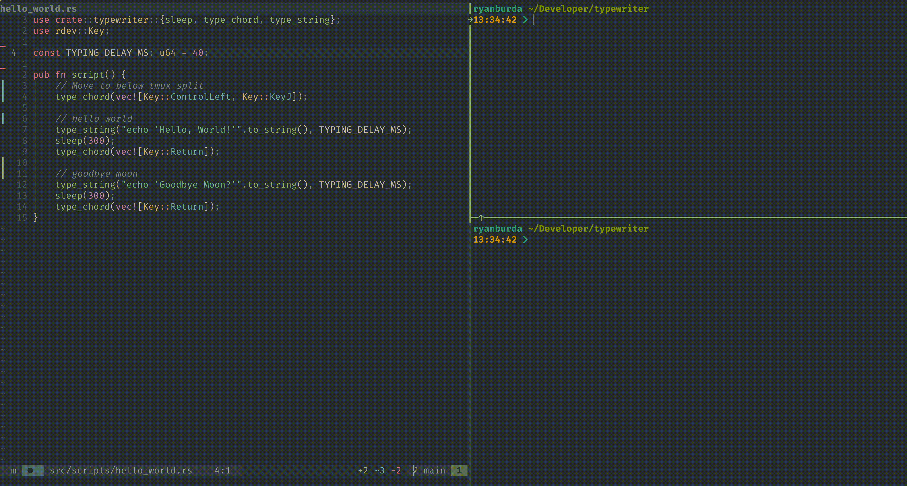

# typewriter

Have a computer type for you

Script sequences of key presses to make demos look buttery



## Installation

```bash
cargo build --release
```

The binary will be available at `target/release/typewriter`.

## Quick Start

Create a script file (e.g., `hello.tw`):

```
// Simple automation script
[MetaLeft, Space];        // Open Spotlight/launcher
300;                       // Wait 300ms
"Terminal";               // Type "Terminal"
[Return];                 // Press Enter
```

Run it:

```bash
typewriter --file hello.tw
```

## Usage

```bash
# Run from file
typewriter --file script.tw

# Run directly from command line
typewriter --script '"Hello"; 100; [Return];'

# Disable mouse click interrupt
typewriter --file script.tw --no-interrupt
```

## Script Syntax

Four simple statement types:

```
"text";                   // Type text (default 50ms delay)
("text", 100);            // Type with custom delay
500;                      // Sleep 500ms
[Ctrl, C];               // Key chord (keyboard shortcut)
```

See [MACRO_GUIDE.md](MACRO_GUIDE.md) for complete syntax reference and examples.

Example scripts are in the `examples/` directory.

## Reference

[OS Caveats](https://docs.rs/rdev/latest/rdev/index.html#os-caveats)

[Key Enum](https://docs.rs/rdev/latest/rdev/enum.Key.html)
